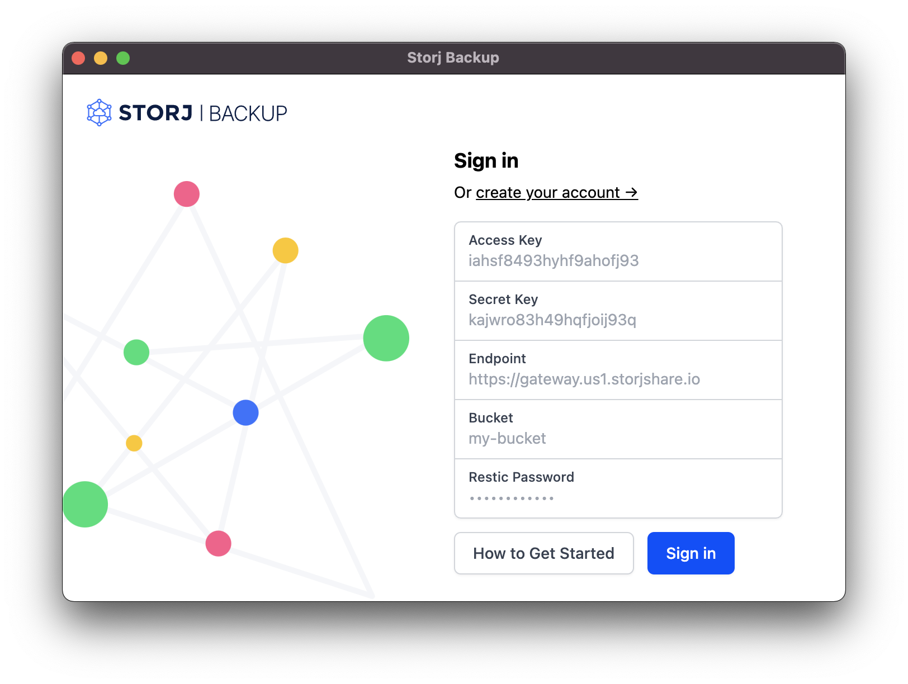

# backup

Easily backup your files with Storj.

> [universe.storj.io](https://universe.storj.io)



## build from source

Requires git, wget, curl, node, npm, and just.

```
git clone https://github.com/storjrd/backup.git
```

```
cd backup
```

```
npm install
```

```
just download-restic
```

finally, launch

```
just
```

## development

```
just dev
```

Alternatively you can run the 'backend' (electron app) and 'frontend' (vue app build) seperately.

```
just backend
```

```
just frontend
```
